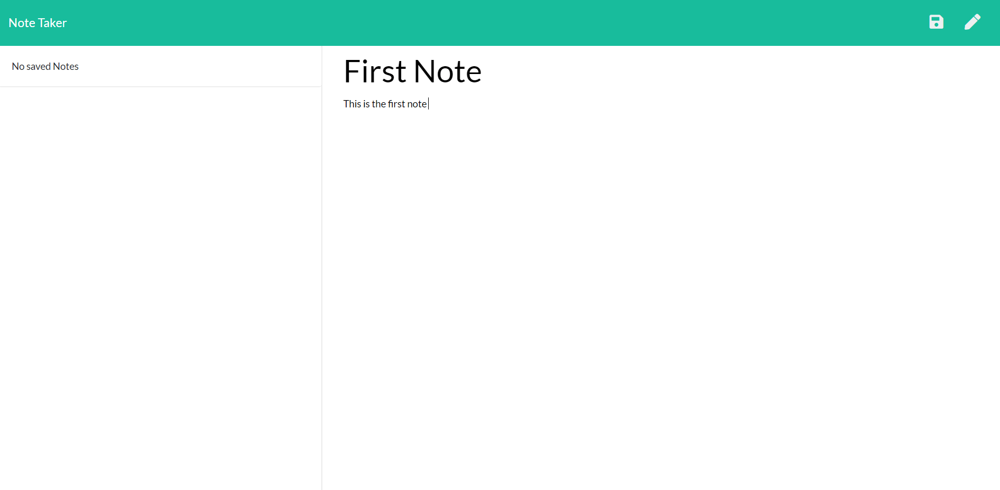
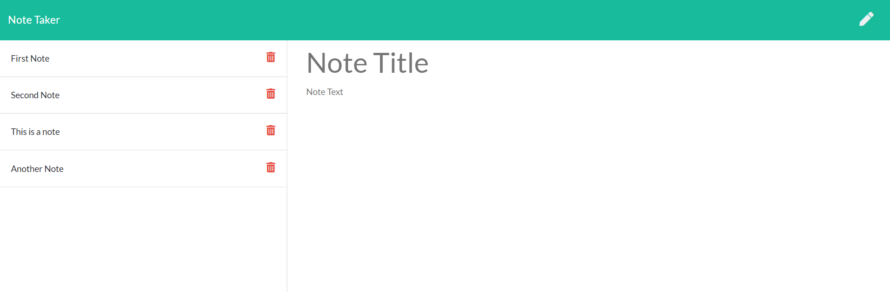

# Express Note Taker 

[](https://www.gnu.org/licenses/gpl-3.0) 
[](http://commonmark.org) 
[](https://GitHub.com/Naereen/StrapDown.js/issues/) 
[](https://GitHub.com/Naereen/StrapDown.js/pull/)
[](https://github.com/Naereen/StrapDown.js)
[](https://github.com/Naereen/badges)
[]()
[]()

## Description

My project is about the back end of development. It has been created to be able to write and save notes, then delete individual notes that have been written before. 

The front end was provided for me and it was my job to create and connect the backend development including persistent data. 

For users that need to keep track of a lot of information, it's easy to forget or be unable to recall something important. Being able to take persistent notes allows users to have written information available when needed. The application helps to organise their thoughts and keep track of their tasks.

I have learnt the backend of API calls, proving GET and POST calls to a persistent .json file. This has also enabled me to solidify my understanding of JSON utilising and visualising exactly what parse and stringify do. I have been able to learn how to separate out my data and retrieve it from other files. 

## Contents: 
1. [Installation](#Instalation) 
2. [Usage](#Usage)
3. [Improvements](#Improvements)
4. [Updates](#Updates)
5. [Credits](#Credits)
6. [License](#License)
7. [Contact](#Contact)

## Instalation

* Step 1: Download the zip file of the project. . <br />
* Step 2: Install the npm dependencies to your machine using first >npm init, then >npm install <package name>. <br />
* Step 3: The dependencies are: body-parser, Express, nodemon, uuid. . <br />


### Technologies 

The technologies I have used are:
* Node.js<br />
* Javascript<br />
* jQuery<br />
* npm <br />
* Express<br />


## Usage

* Step 1: Open the application in the browser window and navigate to the notes page. 



* Step 2: In the Note Title enter the title of your first note. In the note text you can add more detail and description. 
* Step 3: Hit the save button. 
* Step 4: Your notes are saved down the left hand side. Click on one to display the note in the note title and text spaces, or delete the individual note at any time.



* Step 5: the pencil will allow you to create another note. 

### Backstage 

* Step 1: When the page is loaded the server initiates a GET request to the server to find the existing notes. 
* Step 2: Notes are stored in JSON in the db.json file with each note the user makes. 

```
[
    {
        "id":"54b5ee06-b470-4211-9ba3-4bed948b6dfe",
        "title":"First Note",
        "text":"This is the first note. "
    },
    {
        "id":"3b90d804-e177-4824-ae35-78c880acd45b",
        "title":"Second Note ","text":"This is the second Note "
    },
    {
        "id":"ba3f69cf-9f44-4ccc-a96c-8426e3c143c2",
        "title":"This is a note",
        "text":"This is a note This is a note This is a note."
    },
    {
        "id":"300e319c-d19f-41c7-87d9-0efb4ca296f3",
        "title":"Another Note ",
        "text":"This is a note This is a note This is a note. "
    }
]
```
* Step 3: Every time the save button is clicked the new note is aved to the existing notes and written to the db.json file. 
* Step 4: I have utilitsed a "holding" array in the apiRoutes.js file to retreive the notes to, display from, add to, and sort through to delete from. There are functions in place to implement the useage of this correctly and ensure that the db.JSON file is maintained. 


## Improvements

There is nothing to display at this time.


## Updates 

There is nothing to display at this time.

    
## Credits 

[](https://saythanks.io/to/kennethreitz)
Thanks go to:
* Andy Lorenz - For spending the time to help me understand the backend api calls. * Colum Lynagh - For helping sort out the loose ends and functionality of the seperate files. He also helped with express().Router() nodemon and uuid. 

Resources I have referenced:   
* W3Schools<br />
* Stackoverflow<br />
* Postman<br />
* Nodejs.org<br />
* Geeksforgeeks.org 
* Expressjs.com

## License 

* GNU GPL v3<br />  

Where appropriate: 
Alot of the graphics included in my projects I have drawn myself and are copyright 2020. 
No useage without permission. 
If I have not originated the imagery I have gained the permission of the owner and acreditied 
where necessary. These are also not for re-purpose without permission of the owner.

You must make reference where the code originated. I would also love to see what changes and improvements you make.  
Design by Samantha Wakelam, please respect copyright 2020. 


## Contact

* Name: Samantha Wakelam  <br />Email: sam.wakelam@hotmail.co.uk <br />Github Profile: Sam Wakelam 

